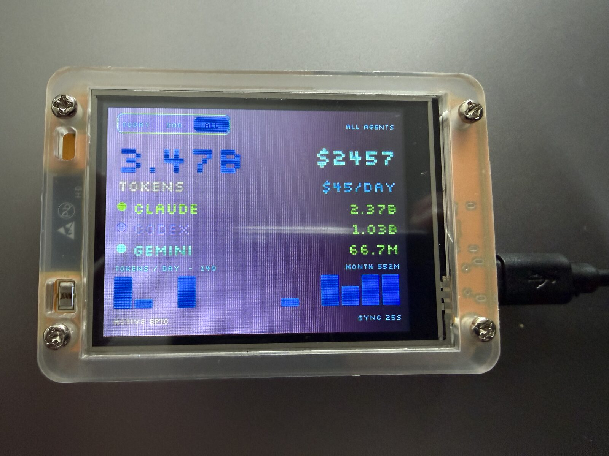

# usage-agent-display



A physical desk panel (a "Cheap Yellow Display" ESP32 board) showing aggregated
AI-coding usage across all my machines, live. A per-machine daemon reads local Claude
Code / Codex usage via `ccusage` and POSTs normalized snapshots to a small central
service; the CYD polls one compact endpoint and renders the numbers. The hero number
is **total tokens used**.

> Why this shape, and the trade-offs behind each decision, live in [`wiki/`](wiki/index.md)
> (start with [architecture](wiki/architecture.md) and the ADRs). Code says what; the
> wiki says why.

## Status — Phase 1

Cross-machine aggregation proven end-to-end: two machines' daemons post real ccusage
totals, the server dedups them (newest *received* wins, daily-only hero), and the CYD
displays the combined token number. See [`wiki/plan.md`](wiki/plan.md) for the phases.

## Layout

```
packages/shared    the v1 /usage/summary wire contract + snapshot types
packages/server    Bun + SQLite API: POST /ingest (dedup upsert), GET /usage/summary
packages/daemon    Bun collector: ccusage --json → normalized rows → POST (bearer)
firmware           PlatformIO/ESP32 (LVGL/TFT_eSPI): poll → render the hero number
scripts            e2e + static gates (no-raw-SQL, secrets scan)
```

## Develop

Requires [Bun](https://bun.sh) ≥ 1.3. `clang++` is used for the off-device firmware test.

```sh
bun install
bun run gate        # the full phase-1 gate: typecheck · no-raw-SQL · secrets ·
                    # unit tests · firmware native test · e2e
```

Individual steps: `bun run typecheck`, `bun run test:unit`, `bun run test:firmware`,
`bun run e2e`, `bun run check:sql`, `bun run scan:secrets`.

### Run it

All three components share one bearer token (`USAGE_BEARER_TOKEN`). Copy `.env.example`
to `.env` and fill it in.

```sh
# server (the central box)
USAGE_BEARER_TOKEN=… bun run packages/server/src/index.ts

# daemon (each machine)
USAGE_BEARER_TOKEN=… USAGE_SERVER_URL=http://<server>:3410 bun run packages/daemon/src/index.ts
```

Firmware: see [`firmware/README.md`](firmware/README.md).

### Run unattended (self-host)

Process recipes live in [`deploy/`](deploy/): `launchd/` for macOS, `systemd/` for
Linux. Copy the unit, fill in the paths + the shared `USAGE_BEARER_TOKEN` (keep the
installed copy out of git), and enable it. The server self-prunes old rows daily
(`USAGE_RETENTION_DAYS`, default 400). A one-shot end-to-end check that starts both
processes from their documented commands:

```sh
bun run smoke:ops
```

### Add a provider (3-year fit)

A provider that emits ccusage-shaped JSON is a registry entry — add a `ProviderSpec`
(`{ provider, command }`) in the daemon and it flows through the same pipeline. A
provider with a *different* shape is a new `Collector` implementation behind the same
interface. Either way the server's aggregation is untouched — it's provider-agnostic
(proven by `packages/daemon/test/extensibility.test.ts`, which adds a "cursor" provider
and asserts it appears in `by_provider[]` and the combined total with zero core change).

## Security

- One shared **bearer token** protects both endpoints (write *and* read). It lives in
  env (server/daemon) and a gitignored `firmware/src/config.h`; never committed, never
  logged.
- `/ingest` strictly **validates and rejects** malformed input (never clamps); all DB
  access goes through prepared statements (enforced by `scripts/check-no-raw-sql.ts`).
- `bun run scan:secrets` runs `gitleaks` (if installed) or a focused fallback scan.

## License

[MIT](LICENSE). The bundled **Silkscreen** font (`firmware/vendor/fonts/`, and the
generated `firmware/src/fonts/pixel*.c`) is © The Silkscreen Project Authors under the
SIL Open Font License 1.1 — see `firmware/vendor/fonts/OFL.txt`.
